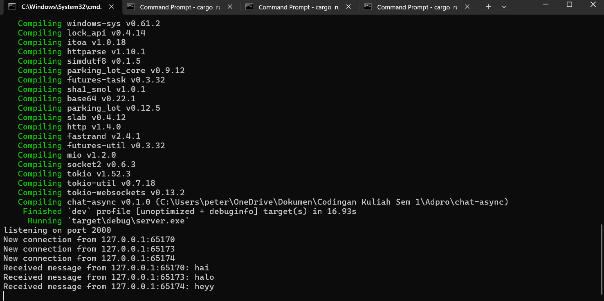
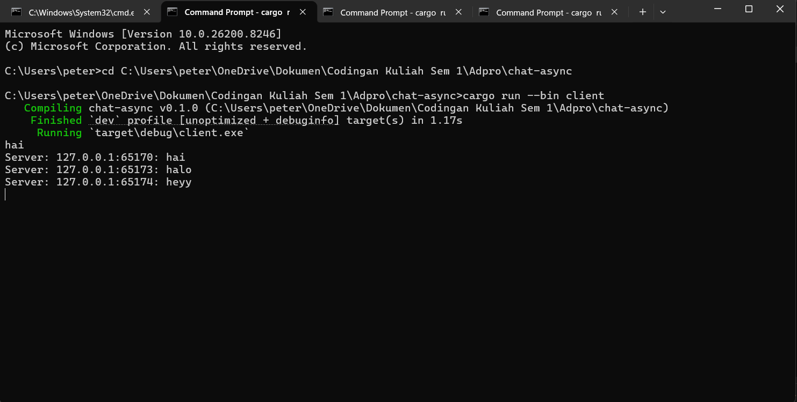
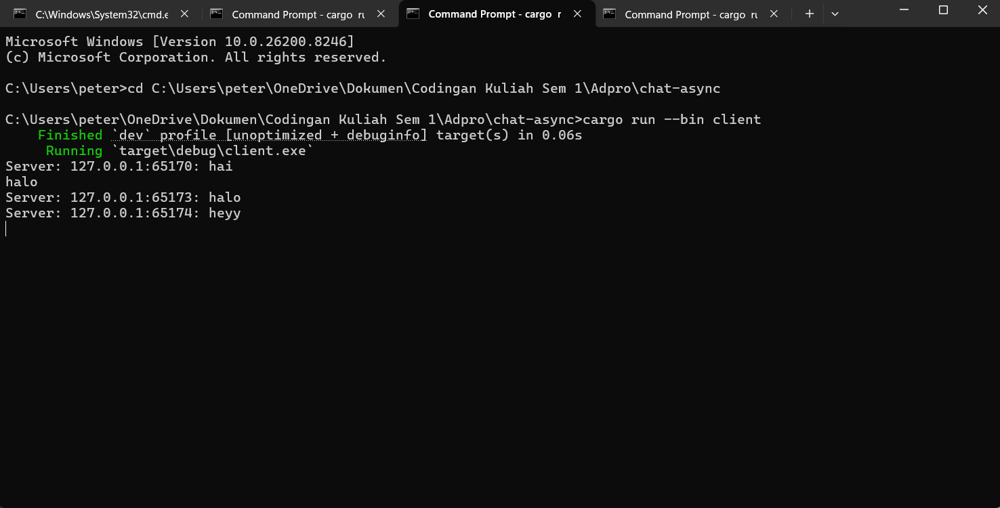
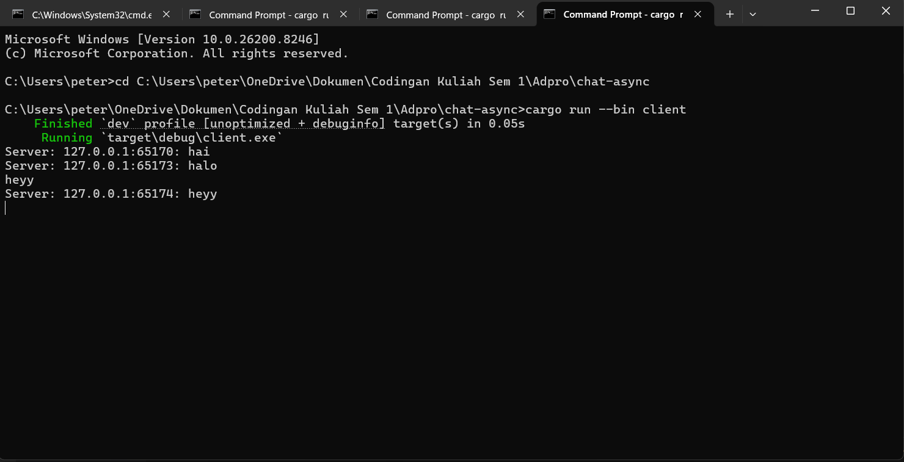

# Reflection

### commit 2.1
#### server side

#### client 1 side

#### client 2 side

#### client 3 side

Untuk menjalankannya simply buat terminal untuk masing-masing sisi dan run setidaknya 1 server dengan command `cargo run --bin server` dan setidaknya 1 client dengan command `cargo run --bin client`. Pada tutorial ini saya membuat 4 terminal total (1 server dan 3 client). Ketika kita mengirim text dari 1 client, server akan mengeprint text dari 1 client tersebut beserta detail dari port apa. Selain itu, client lain juga menerima pesan tersebut.

### commit 2.2
Untuk mengubah port bisa dilakukan dengan mengubah port di sisi client(pada function main di ClientBuilder) dan sisi server(pada function main di listener). Mereka menggunakan protokol websocket yang sama. Untuk pendefinisian protokol websocketnya, pada sisi client dilakukan di string URInya (`ws://`) pada pemanggilan `Uri::from_static("ws://127.0.0.1:8080")`. Sedangkan pada sisi server di `let (_req, ws_stream) = ServerBuilder::new().accept(socket).await?;`(pada saat server mengewrap TCP biasa).